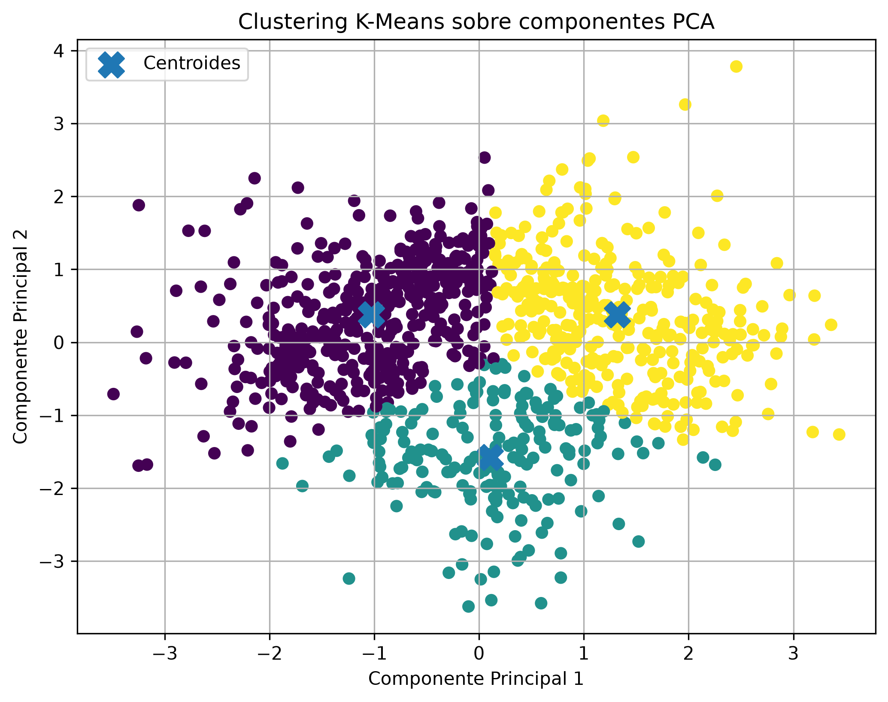

# Examen de Inteligencia Artificial 2026-2

## Universidad Andina del Cusco

**Curso:** Inteligencia Artificial  
**Estudiante:** Jerson Americo Peña Salgueron  
**Periodo:** 2026-2  

---

# 1. Descripción del proyecto

El presente proyecto desarrolla un pipeline modular de Inteligencia Artificial utilizando Python y la biblioteca Scikit-learn.

El objetivo principal es implementar en un solo proyecto dos enfoques de aprendizaje automático:

1. **Aprendizaje supervisado**, mediante un modelo de clasificación.
2. **Aprendizaje no supervisado**, mediante reducción de dimensionalidad con PCA y agrupamiento con K-Means.

El proyecto comienza con la generación automática de un dataset sintético, continúa con el preprocesamiento de los datos, posteriormente entrena y evalúa un modelo supervisado y finalmente realiza un proceso de clustering sobre los mismos datos.

Todo el proceso se encuentra dividido en diferentes módulos de Python para mantener una arquitectura organizada, reutilizable y fácil de mantener.

---

# 2. Objetivo

Diseñar e implementar un pipeline modular en Python que permita:

- Generar un dataset sintético.
- Guardar el dataset en formato CSV.
- Cargar y preparar los datos.
- Dividir los datos en entrenamiento y prueba.
- Aplicar normalización con StandardScaler.
- Entrenar un modelo de clasificación supervisada.
- Evaluar el modelo mediante Accuracy, F1-Score y Matriz de Confusión.
- Aplicar PCA para reducir la dimensionalidad.
- Aplicar K-Means para realizar agrupamiento no supervisado.
- Obtener el Silhouette Score.
- Calcular la varianza explicada acumulada de PCA.
- Visualizar los clusters obtenidos en un gráfico bidimensional.

---

# 3. Tecnologías utilizadas

Para el desarrollo del proyecto se utilizaron las siguientes tecnologías:

- **Python 3**
- **Visual Studio Code**
- **Pandas**
- **Scikit-learn**
- **Matplotlib**
- **Git**
- **GitHub**

Las principales librerías utilizadas fueron:

```python
pandas
scikit-learn
matplotlib
```

Estas pueden instalarse utilizando:

```bash
py -m pip install pandas scikit-learn matplotlib
```

---

# 4. Arquitectura del proyecto

El proyecto fue desarrollado utilizando una arquitectura modular.

```text
lab-evaluacion/
│
├── data/
│   └── dataset.csv
│
├── src/
│   ├── data_loader.py
│   ├── preprocessing.py
│   ├── supervised_model.py
│   └── unsupervised_model.py
│
├── main.py
├── pca_kmeans.png
├── README.md
└── .gitignore
```

Cada archivo tiene una función específica dentro del pipeline.

---

# 5. Descripción de los módulos

## 5.1. `data_loader.py`

Este módulo es responsable de la generación y almacenamiento del dataset utilizado durante el proyecto.

Se utilizó la función:

```python
make_classification()
```

de Scikit-learn.

La configuración utilizada fue:

```python
X, y = make_classification(
    n_samples=1000,
    n_features=4,
    n_informative=4,
    n_redundant=0,
    n_classes=3,
    random_state=42
)
```

Esto genera:

- **1000 registros**
- **4 características continuas**
- **3 clases**
- **1 variable objetivo**

Las características creadas fueron:

```text
caracteristica_1
caracteristica_2
caracteristica_3
caracteristica_4
```

También se creó la variable:

```text
objetivo
```

La variable objetivo puede tomar los valores:

```text
0
1
2
```

Por lo tanto, el problema corresponde a una **clasificación multiclase**.

Posteriormente, los datos se convierten a un DataFrame utilizando Pandas:

```python
df = pd.DataFrame(X)
```

Finalmente, el dataset generado se almacena en:

```text
data/dataset.csv
```

mediante:

```python
df.to_csv("data/dataset.csv", index=False)
```

Esto permite conservar los datos generados y utilizarlos posteriormente.

---

# 6. Dataset generado

El dataset contiene cinco columnas:

| Variable | Descripción |
|---|---|
| caracteristica_1 | Primera variable numérica continua |
| caracteristica_2 | Segunda variable numérica continua |
| caracteristica_3 | Tercera variable numérica continua |
| caracteristica_4 | Cuarta variable numérica continua |
| objetivo | Clase a la que pertenece cada observación |

Ejemplo de los primeros registros obtenidos:

```text
   caracteristica_1  caracteristica_2  caracteristica_3  caracteristica_4  objetivo
0         -0.268999          2.047059         -4.687296         -0.873852         2
1          0.439745         -1.884729          0.264197          1.734492         1
2          0.002481          1.873506          0.160924          2.684806         2
3         -0.664447         -0.993198         -1.611478          1.376072         1
4          2.829484          2.541624          0.968068         -0.099387         0
```

---

# 7. Preprocesamiento de datos

El preprocesamiento fue implementado en:

```text
src/preprocessing.py
```

Para normalizar las características se utilizó:

```python
StandardScaler
```

El proceso realizado fue:

```python
scaler = StandardScaler()

X_train_scaled = scaler.fit_transform(X_train)
X_test_scaled = scaler.transform(X_test)
```

Un aspecto importante del desarrollo es que `StandardScaler` se ajusta únicamente utilizando los datos de entrenamiento.

Es decir:

```python
fit_transform(X_train)
```

aprende la media y desviación estándar utilizando únicamente el conjunto de entrenamiento.

Posteriormente:

```python
transform(X_test)
```

aplica esa misma transformación al conjunto de prueba.

Esto evita el problema conocido como **data leakage**, debido a que el modelo no utiliza información del conjunto de prueba durante su entrenamiento.

---

# 8. Aprendizaje supervisado

El modelo supervisado fue implementado dentro de:

```text
src/supervised_model.py
```

## 8.1. División de datos

Los datos fueron divididos en:

- **80 % para entrenamiento**
- **20 % para prueba**

mediante:

```python
train_test_split(
    X,
    y,
    test_size=0.20,
    random_state=42,
    stratify=y
)
```

Se utilizó:

```python
stratify=y
```

para mantener aproximadamente la misma distribución de clases tanto en entrenamiento como en prueba.

---

# 9. Modelo de clasificación

Para realizar la clasificación se utilizó:

```text
Regresión Logística
```

El modelo fue creado mediante:

```python
LogisticRegression(
    max_iter=1000,
    random_state=42
)
```

Posteriormente se realizó el entrenamiento:

```python
modelo.fit(X_train_scaled, y_train)
```

Finalmente, se realizaron predicciones sobre los datos que el modelo no utilizó durante el entrenamiento:

```python
y_pred = modelo.predict(X_test_scaled)
```

---

# 10. Métricas del modelo supervisado

Para evaluar el comportamiento del modelo se utilizaron tres métricas:

- Accuracy
- F1-Score
- Matriz de Confusión

---

## 10.1. Accuracy

El resultado obtenido fue:

```text
Accuracy: 0.6850
```

Esto equivale aproximadamente a:

```text
68.50 %
```

El Accuracy representa el porcentaje total de observaciones que fueron clasificadas correctamente.

Por lo tanto, el modelo logró clasificar correctamente aproximadamente **68 de cada 100 registros del conjunto de prueba**.

---

## 10.2. F1-Score

El resultado obtenido fue:

```text
F1-Score: 0.6761
```

Esto corresponde aproximadamente a:

```text
67.61 %
```

El F1-Score combina dos conceptos importantes:

- Precisión.
- Recall o sensibilidad.

Al tratarse de una clasificación multiclase se utilizó:

```python
average="weighted"
```

para considerar la cantidad de elementos existentes en cada clase.

---

# 11. Matriz de Confusión

La matriz obtenida durante la ejecución fue:

```text
[[57  3  6]
 [ 1 50 16]
 [13 24 30]]
```

Puede representarse de la siguiente forma:

| Clase real / predicción | Clase 0 | Clase 1 | Clase 2 |
|---|---:|---:|---:|
| Clase 0 | 57 | 3 | 6 |
| Clase 1 | 1 | 50 | 16 |
| Clase 2 | 13 | 24 | 30 |

Los valores ubicados en la diagonal principal representan las predicciones correctas.

Por ejemplo:

- **57 elementos de la clase 0** fueron correctamente clasificados como clase 0.
- **50 elementos de la clase 1** fueron correctamente clasificados como clase 1.
- **30 elementos de la clase 2** fueron correctamente clasificados como clase 2.

Los valores ubicados fuera de la diagonal representan errores de clasificación.

La clase que presenta mayores dificultades para el modelo es la clase 2, debido a que varios registros de dicha clase fueron clasificados como clase 0 o clase 1.

---

# 12. Aprendizaje no supervisado

La segunda parte del proyecto implementa técnicas de aprendizaje no supervisado.

El módulo encargado es:

```text
src/unsupervised_model.py
```

El proceso utilizado fue:

```text
Datos originales
       ↓
StandardScaler
       ↓
      PCA
       ↓
2 componentes principales
       ↓
    K-Means
       ↓
   3 clusters
       ↓
Silhouette Score
       ↓
Visualización 2D
```

---

# 13. Normalización para clustering

Antes de aplicar PCA también se normalizaron los datos utilizando:

```python
StandardScaler()
```

Esto es importante debido a que PCA y K-Means pueden verse afectados cuando las variables presentan escalas diferentes.

De esta manera todas las características tienen una escala comparable antes de realizar el análisis.

---

# 14. Reducción de dimensionalidad con PCA

Se utilizó la técnica:

```text
Principal Component Analysis - PCA
```

La función utilizada fue:

```python
PCA(n_components=2)
```

El dataset originalmente posee:

```text
4 características
```

Después de PCA se obtienen:

```text
2 componentes principales
```

El objetivo de PCA es representar la información original utilizando un número menor de dimensiones, manteniendo la mayor cantidad de variabilidad posible.

Esto además permite representar los datos gráficamente utilizando dos ejes:

```text
Componente Principal 1
Componente Principal 2
```

---

# 15. Varianza explicada

El resultado obtenido fue:

```text
Varianza explicada acumulada: 0.6964
```

Esto corresponde aproximadamente a:

```text
69.64 %
```

Esto significa que las dos componentes principales conservan aproximadamente el **69.64 % de la variabilidad presente en las cuatro características originales**.

Por lo tanto, PCA permitió reducir las cuatro dimensiones originales a solamente dos manteniendo una parte importante de la información del dataset.

---

# 16. Agrupamiento con K-Means

Después de aplicar PCA se utilizó el algoritmo:

```text
K-Means
```

El número de grupos establecido fue:

```text
k = 3
```

mediante:

```python
KMeans(
    n_clusters=3,
    random_state=42,
    n_init=10
)
```

K-Means analiza la distancia entre las observaciones y agrupa aquellos elementos que presentan características similares.

El resultado fue la creación de:

```text
Cluster 0
Cluster 1
Cluster 2
```

Cada punto pertenece al grupo cuyo centroide se encuentra más cercano.

---

# 17. Silhouette Score

Para evaluar la calidad del clustering se utilizó el:

```text
Silhouette Score
```

El resultado obtenido fue:

```text
Silhouette Score: 0.4009
```

El Silhouette Score mide qué tan similar es una observación respecto a los elementos de su propio grupo comparado con los elementos de otros grupos.

El valor obtenido indica que existe una **separación moderada entre los clusters**.

En el gráfico puede observarse que los tres grupos tienen zonas diferenciadas, aunque existen regiones donde algunos puntos se encuentran próximos entre sí.

---

# 18. Visualización PCA + K-Means

El resultado del proceso de reducción de dimensionalidad y clustering se representa mediante el siguiente gráfico:



En la visualización:

- Cada punto representa un registro del dataset.
- Los colores representan los clusters encontrados por K-Means.
- Las marcas en forma de `X` representan los centroides.
- El eje horizontal representa la primera componente principal.
- El eje vertical representa la segunda componente principal.

La visualización permite observar cómo K-Means dividió los datos en tres regiones principales.

---

# 19. Flujo completo del pipeline

El funcionamiento completo del sistema puede resumirse de la siguiente manera:

```text
Inicio
  │
  ▼
Generación de dataset sintético
  │
  ▼
1000 registros
4 características
3 clases
  │
  ▼
Guardar dataset.csv
  │
  ▼
Separación X / y
  │
  ├──────────────────────────────────┐
  │                                  │
  ▼                                  ▼
PIPELINE SUPERVISADO          PIPELINE NO SUPERVISADO
  │                                  │
  ▼                                  ▼
Train/Test 80/20              StandardScaler
  │                                  │
  ▼                                  ▼
StandardScaler                       PCA
  │                                  │
  ▼                                  ▼
Regresión Logística          4 dimensiones → 2
  │                                  │
  ▼                                  ▼
Predicciones                    K-Means k=3
  │                                  │
  ▼                                  ▼
Accuracy                       Silhouette Score
F1-Score                       Varianza explicada
Matriz de Confusión                   │
  │                                  ▼
  │                           Visualización 2D
  │                                  │
  └───────────────┬──────────────────┘
                  ▼
                 Fin
```

---

# 20. Archivo principal `main.py`

El archivo:

```text
main.py
```

funciona como el orquestador principal del proyecto.

Su función es conectar los diferentes módulos.

Primero genera el dataset:

```python
df = generar_dataset()
```

Posteriormente separa las características:

```python
X
```

de la variable objetivo:

```python
y
```

Luego ejecuta el modelo supervisado:

```python
entrenar_modelo_supervisado(X, y)
```

Finalmente ejecuta el modelo no supervisado:

```python
entrenar_modelo_no_supervisado(X)
```

De esta manera todo el pipeline puede ejecutarse desde un solo archivo.

---

# 21. Ejecución del proyecto

Para ejecutar el proyecto se debe abrir una terminal en la carpeta:

```text
lab-evaluacion
```

Posteriormente ejecutar:

```bash
py main.py
```

El programa realiza automáticamente las siguientes acciones:

1. Genera el dataset.
2. Guarda `dataset.csv`.
3. Muestra los primeros registros.
4. Divide los datos en entrenamiento y prueba.
5. Escala las características.
6. Entrena la Regresión Logística.
7. Calcula Accuracy.
8. Calcula F1-Score.
9. Genera la Matriz de Confusión.
10. Escala los datos para PCA.
11. Reduce cuatro características a dos componentes.
12. Ejecuta K-Means con tres clusters.
13. Calcula la varianza explicada.
14. Calcula el Silhouette Score.
15. Genera la visualización de los clusters.
16. Guarda el gráfico en `pca_kmeans.png`.

---

# 22. Resultados generales

## Aprendizaje supervisado

| Métrica | Resultado |
|---|---:|
| Accuracy | 0.6850 |
| F1-Score | 0.6761 |
| Registros | 1000 |
| División Train/Test | 80/20 |
| Clasificador | Regresión Logística |

## Aprendizaje no supervisado

| Métrica | Resultado |
|---|---:|
| Número de componentes PCA | 2 |
| Varianza explicada acumulada | 0.6964 |
| Número de clusters | 3 |
| Silhouette Score | 0.4009 |
| Algoritmo | K-Means |

---

# 23. Interpretación de resultados

Los resultados obtenidos muestran que es posible aplicar sobre un mismo dataset técnicas de aprendizaje supervisado y no supervisado.

En el aprendizaje supervisado, la Regresión Logística obtuvo un Accuracy de **68.50 %** y un F1-Score de **67.61 %**, mostrando una capacidad moderada para diferenciar las tres clases generadas.

La matriz de confusión permite observar que las clases 0 y 1 presentan una mayor cantidad de predicciones correctas, mientras que la clase 2 presenta un mayor nivel de confusión.

En el aprendizaje no supervisado, PCA permitió conservar aproximadamente el **69.64 % de la variabilidad original** utilizando únicamente dos dimensiones.

Posteriormente, K-Means generó tres clusters y obtuvo un Silhouette Score de **0.4009**, lo cual evidencia una separación moderada entre los grupos.

La representación gráfica permite observar visualmente los clusters y sus respectivos centroides.

---

# 24. Importancia de la modularización

El proyecto fue dividido en diferentes archivos para evitar colocar todo el código dentro de un solo programa.

La modularización permite:

- Mejor organización del código.
- Mayor facilidad para realizar modificaciones.
- Reutilización de funciones.
- Mayor facilidad para detectar errores.
- Separación de responsabilidades.
- Mejor mantenimiento del proyecto.

Cada módulo cumple una función determinada:

```text
data_loader.py
       ↓
Generación de datos

preprocessing.py
       ↓
Escalamiento

supervised_model.py
       ↓
Clasificación

unsupervised_model.py
       ↓
PCA + clustering

main.py
       ↓
Orquestación
```

---

# 25. Reproducibilidad

Se utilizó:

```python
random_state=42
```

en diferentes partes del proyecto.

Esto permite obtener resultados reproducibles al volver a ejecutar el programa.

Por ejemplo, se utilizó en:

- Generación del dataset.
- División Train/Test.
- Regresión Logística.
- K-Means.

Esto facilita comprobar y repetir los resultados del experimento.

---

# 26. Conclusiones

Se logró implementar correctamente un pipeline modular de Inteligencia Artificial utilizando Python y Scikit-learn. El sistema genera automáticamente un dataset sintético con cuatro características y tres clases, aplica técnicas de preprocesamiento y posteriormente ejecuta dos enfoques diferentes de aprendizaje automático. En el aprendizaje supervisado se utilizó Regresión Logística, obteniendo un Accuracy de 0.6850 y un F1-Score de 0.6761. En el aprendizaje no supervisado se aplicó PCA para reducir las cuatro características originales a dos componentes principales, conservando aproximadamente el 69.64 % de la varianza, y posteriormente K-Means permitió formar tres clusters con un Silhouette Score de 0.4009. Finalmente, la organización modular permitió separar las responsabilidades del sistema y ejecutar todo el proceso mediante un único archivo principal.

---

# 27. Archivos generados

Durante la ejecución se generan los siguientes archivos:

```text
data/dataset.csv
pca_kmeans.png
```

`dataset.csv` contiene los datos utilizados durante el experimento.

`pca_kmeans.png` contiene la representación gráfica del resultado de PCA y K-Means.

---

# 28. Repositorio

Este repositorio contiene todo el código fuente correspondiente al Examen de Inteligencia Artificial 2026-2.

Autor:

**Jerson Americo Peña Salgueron**